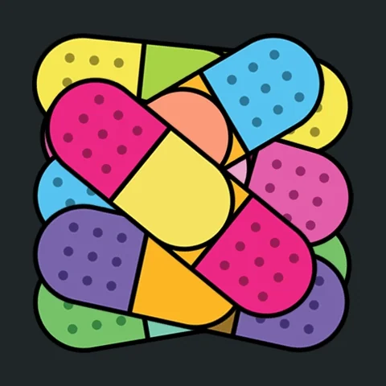

<div align="center">
    


    

# **Self-healing locators for Playwright.**

A deterministic-first, LLM-optional resilience layer that keeps a TypeScript end-to-end suite green while the UI underneath it shifts — without hiding real regressions.

> Clone repo, run `npm test`, and watch tests pass against deliberately broken selectors. No API key required.

</div>

## The problem this solves

Most failures aren't bugs — they're broken *locators*. A developer renames a CSS class or restructures the DOM, and `page.locator('.btn-primary')` matches nothing. The feature still works; the test lies.

`selfless-healer` adds a thin recovery layer in front of your locators. When the intended selector breaks, it re-finds the element from its *semantic intent* (accessibility role, test id, label, text), records the heal so the drift is visible, and caches the fix so it's paid for once. Crucially, it heals broken **locators**, never broken **features** — if an element genuinely no longer exists, the test fails loudly.

## Project structure

```
selfless-healer/
├─ src/self-heal/
│  ├─ engine.ts        # the four-tier resolver (orchestration)
│  ├─ strategies.ts    # descriptor → ordered, replayable recipes
│  ├─ cache.ts         # persistent fast-path for prior heals
│  ├─ logger.ts        # auditable heal report
│  ├─ llm.ts           # optional, soft-dependency LLM tier
│  ├─ config.ts        # env-driven configuration
│  ├─ fixtures.ts      # Playwright `sh` fixture
│  └─ types.ts
├─ tests/
│  ├─ pages/           # page objects (with deliberately stale selectors)
│  └─ saucedemo.spec.ts
├─ .github/workflows/ci.yml
└─ playwright.config.ts
```

## Quick start

```bash
git clone https://github.com/avramare/selfless-healer.git
cd selfless-healer
npm install
npx playwright install --with-deps chromium
npm test
```

The demo runs against the public [SauceDemo](https://www.saucedemo.com/) site. 
Several page-object selectors are intentionally stale (suffixed `__legacy`), so you'll see lines like:

```
💊[selfless-healer] healed "login.username" via rule-based: #user-name__legacy → testId(username) (1 match)
💊[selfless-healer] healed "login.submit"  via rule-based: .btn_login--legacy → role(button, name="Login") (1 match)
```

Then inspect the audit trail:

```bash
npm run heal:report      # prints .self-heal/heal-report.json
npm run report           # opens the Playwright HTML report
```

## Using it in your own suite

Author locators by *intent*, with the precise selector as the primary and semantic facts as fallbacks:

```ts
import { test, expect } from "./src/self-heal/fixtures";

test("checkout", async ({ page, sh }) => {
  await page.goto("/cart");

  const checkout = await sh.find({
    key: "cart.checkout",
    primary: "#checkout-btn",                 // tried first
    intent: "The checkout button on the cart page",
    fallbacks: {
      role: { role: "button", name: "Checkout" },
      testId: "checkout",
    },
  });

  await checkout.click();
  await expect(page).toHaveURL(/checkout/);
});
```

When `#checkout-btn` is renamed, the role/test-id fallbacks recover it, the heal is logged.

## CI/CD

`.github/workflows/ci.yml` runs on every push and PR: install → type-check → install browser → test → upload the Playwright report **and** the heal report as artifacts. The LLM tier stays off in CI unless you set the `SELF_HEAL_LLM` repo variable and an `ANTHROPIC_API_KEY` secret.
